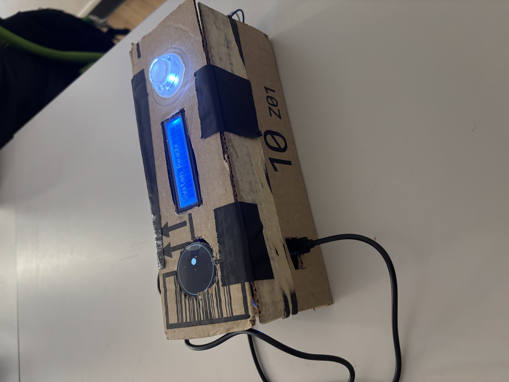
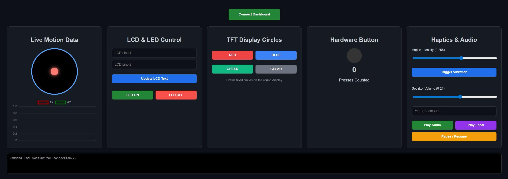

# The Hyphen: Simulating the Weight of Opposing Forces

## What is it?
**The Hyphen** is a handheld haptic interface and interactive display system built on the ESP32-S3. It is designed to simulate the tension and weight between two unresolved states. The project uses tactile feedback, a dual-bus display system, and motion sensing to represent two abstract worlds pulling apart.

## Current Project State
The electronic configuration and code are now fully resolved. The wiring is complete and functional, and all sensors, displays, and haptic systems are successfully integrated via a dual-bus I2C architecture.

**Next Steps:**
- Refining and optimizing the code logic.
- Finalizing the physical body and case design.
- Fabricating and resolving the handheld enclosure.

## Web Dashboard
The project features a comprehensive Web Serial-based dashboard that allows for real-time interaction and telemetry monitoring without requiring an internet connection. 

**Dashboard Capabilities:**
- **Real-time Telemetry:** Live visualization of accelerometer data and hardware button state.
- **Audio Control:** Dynamic MP3 streaming and playback control (Play/Pause/Volume).
- **Display Management:** Remote updates for both the 16x2 LCD text and the round TFT background colors.
- **Haptic Tuning:** Adjustable haptic intensity and manual vibration triggering.

## Core Features
- **Dual-State Haptics:** Powered by the DRV2605L driver, the device vibrates between unresolved states to simulate the "weight" of opposing forces.
- **Interactive Visuals:** 
  - A **Round TFT Display (GC9A01A)** acts as a "bubble level" to show the gravitational pull between worlds, controlled by an MPU6050/LSM6DS gyro.
  - A **16x2 I2C LCD** provides real-time status, live song metadata, and IP connectivity information.
- **Audio Integration:** I2S Audio playback (via `ESP32-audioI2S`) with live metadata scrolling on the LCD.
- **Web Dashboard:** A custom-built, real-time web interface for:
  - Monitoring live Accelerometer/Gyro data.
  - Controlling LCD text and TFT background colors.
  - Triggering haptic vibration patterns.
  - Managing audio streams (Play/Pause/Volume).
- **Dual I2C Bus Architecture:** Optimized performance using two separate I2C buses (Wire and Wire1) to prevent data bottlenecks between sensors and displays.

## Hardware Setup
- **Microcontroller:** ESP32-S3 DevKit
- **Sensors:** MPU6050 / LSM6DS (I2C Pins: SDA 8, SCL 9)
- **Haptics:** DRV2605L Haptic Driver (I2C Pins: SDA 8, SCL 9)
- **LCD:** 16x2 I2C Display (I2C Pins: SDA 17, SCL 18)
- **Round TFT:** Waveshare/Adafruit GC9A01A (SPI)
- **Audio:** I2S DAC/Amplifier (BCLK 1, LRC 2, DIN 3)

## Software Requirements
- **PlatformIO** (VS Code Extension)
- **Libraries:**
  - `ESP32-audioI2S`
  - `Adafruit_GC9A01A`
  - `LiquidCrystal_I2C`
  - `ArduinoJson`
  - `Adafruit_DRV2605`

## How to Use
1. **Flash the ESP32:** Use PlatformIO to upload the code in `src/main.cpp`.
2. **Open the Dashboard:** Open `index.html` in a modern web browser (Chrome or Edge recommended for Web Serial support).
3. **Connect:** Click "Connect Dashboard" and select the ESP32's COM port.
4. **Interact:** Tilt the device to see the bubble move, and use the dashboard to trigger haptics or play audio.
